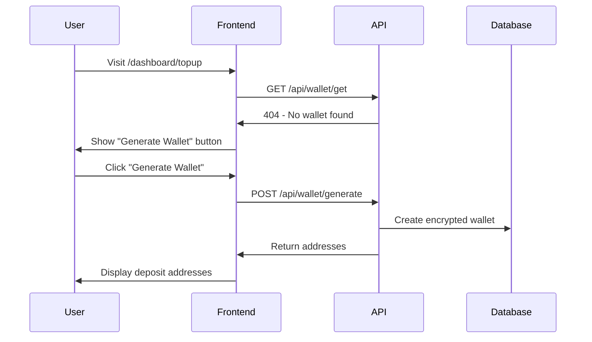
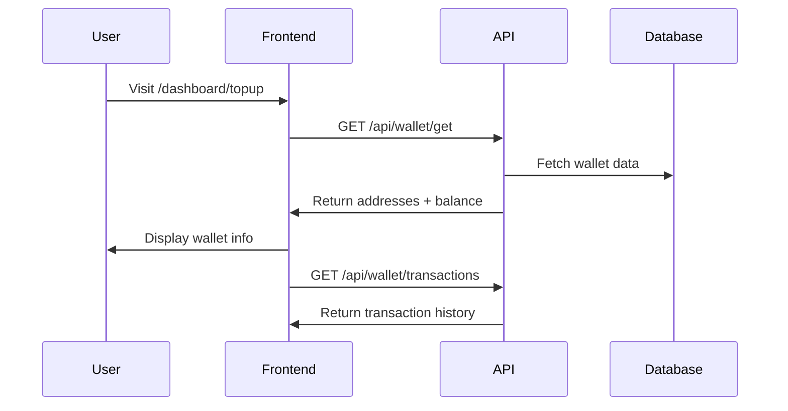
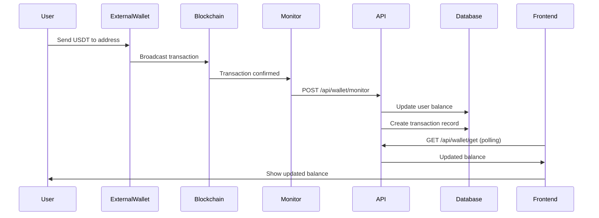

# USDT Wallet System - Implementation Guide

## 🏗 System Architecture

### Frontend (React/Next.js)
- **Page**: `/dashboard/topup`
- **Features**: Wallet generation, address display, QR codes, transaction history
- **Networks**: ERC-20 (Ethereum) & BEP-20 (Binance Smart Chain)
- **UI**: Responsive design with light/dark mode support

### Backend APIs
- **`/api/wallet/generate`** - Generate unique wallet per user
- **`/api/wallet/get`** - Retrieve existing wallet data
- **`/api/wallet/transactions`** - Get transaction history
- **`/api/wallet/monitor`** - Blockchain monitoring & balance updates

## 🔐 Security Features

### Private Key Protection
```typescript
// AES-256 Encryption
const encrypt = (privateKey: string): string => {
  const cipher = crypto.createCipher('aes-256-cbc', ENCRYPTION_KEY);
  return cipher.update(privateKey, 'utf8', 'hex') + cipher.final('hex');
}

// Stored in database as encrypted string
walletData: {
  encryptedPrivateKey: string; // AES-256 encrypted
  erc20Address: string;        // Public address (safe to display)
  bep20Address: string;        // Same address for both networks
}
```

### User Isolation
- Each user gets unique wallet addresses
- Private keys never exposed to frontend
- Session-based authentication required
- Database-level user separation

## 📊 Database Schema

### User Model Enhancement
```typescript
interface IUser {
  // ... existing fields
  walletData?: {
    erc20Address: string;
    bep20Address: string;
    encryptedPrivateKey: string;
    balance: number;
    createdAt: Date;
  };
}
```

### Transaction Model
```typescript
interface ITransaction {
  userId: ObjectId;
  network: 'ERC20' | 'BEP20';
  txHash: string;
  amount: number;
  status: 'pending' | 'confirmed' | 'failed';
  blockNumber?: number;
  walletAddress: string;
  createdAt: Date;
}
```

## 🌐 Blockchain Integration

### Supported Networks
```typescript
const NETWORKS = {
  ERC20: {
    name: 'Ethereum',
    rpcUrl: process.env.ETHEREUM_RPC_URL,
    usdtContract: '0xdAC17F958D2ee523a2206206994597C13D831ec7',
    decimals: 6,
    explorer: 'https://etherscan.io'
  },
  BEP20: {
    name: 'Binance Smart Chain',
    rpcUrl: process.env.BSC_RPC_URL,
    usdtContract: '0x55d398326f99059fF775485246999027B3197955',
    decimals: 6,
    explorer: 'https://bscscan.com'
  }
};
```

### Transaction Monitoring
```typescript
// Monitor incoming USDT transfers
const monitorTransaction = async (txHash: string, network: string) => {
  const provider = new ethers.JsonRpcProvider(rpcUrl);
  const receipt = await provider.getTransactionReceipt(txHash);
  
  // Parse USDT transfer events
  const transfers = receipt.logs.filter(log => 
    log.address.toLowerCase() === usdtContract.toLowerCase()
  );
  
  // Auto-update user balance
  await User.findByIdAndUpdate(userId, {
    $inc: { 'walletData.balance': amount }
  });
};
```

## 🚀 API Endpoints

### 1. Generate Wallet
```http
POST /api/wallet/generate
Authorization: Bearer <session-token>

Response:
{
  "erc20Address": "0x1234...",
  "bep20Address": "0x1234...",
  "balance": 0
}
```

### 2. Get Wallet Data
```http
GET /api/wallet/get
Authorization: Bearer <session-token>

Response:
{
  "erc20Address": "0x1234...",
  "bep20Address": "0x1234...",
  "balance": 150.50
}
```

### 3. Transaction History
```http
GET /api/wallet/transactions
Authorization: Bearer <session-token>

Response:
[
  {
    "id": "tx123",
    "network": "ERC20",
    "txHash": "0xabc...",
    "amount": 100,
    "status": "confirmed",
    "createdAt": "2025-10-09T10:00:00Z"
  }
]
```

### 4. Monitor Transaction (Webhook/Manual)
```http
POST /api/wallet/monitor
Content-Type: application/json

{
  "network": "ERC20",
  "txHash": "0xabc123..."
}

Response:
{
  "success": true,
  "txHash": "0xabc123...",
  "status": "confirmed",
  "processedTransfers": [
    {
      "userEmail": "user@example.com",
      "amount": 100,
      "status": "confirmed"
    }
  ]
}
```

## ⚙️ Environment Variables

```env
# Blockchain RPC URLs
ETHEREUM_RPC_URL=https://eth-mainnet.g.alchemy.com/v2/your-key
BSC_RPC_URL=https://bsc-dataseed.binance.org/

# Encryption
ENCRYPTION_SECRET_KEY=your-32-character-secret-key-here

# Database
MONGODB_URI=mongodb://localhost:27017/futurepilot

# NextAuth
NEXTAUTH_SECRET=your-nextauth-secret
NEXTAUTH_URL=http://localhost:3000
```

## 🔄 User Flow

### 1. First Time User


### 2. Existing User with Wallet


### 3. Deposit Process


## 🛠 Development Setup

### 1. Install Dependencies
```bash
npm install ethers
```

### 2. Environment Setup
```bash
cp .env.example .env.local
# Edit .env.local with your RPC URLs and keys
```

### 3. Database Migration
```bash
# User model automatically updated with walletData field
# Transaction model created for deposit tracking
```

### 4. Test Wallet Generation
```bash
curl -X POST http://localhost:3000/api/wallet/generate \
  -H "Cookie: next-auth.session-token=<your-session>" \
  -H "Content-Type: application/json"
```

## 🔧 Production Considerations

### 1. RPC Provider Setup
- Use reliable providers (Alchemy, Infura, QuickNode)
- Implement rate limiting and retry logic
- Monitor API usage and costs

### 2. Security Hardening
```typescript
// Production encryption setup
const ENCRYPTION_KEY = process.env.ENCRYPTION_SECRET_KEY;
if (!ENCRYPTION_KEY || ENCRYPTION_KEY.length < 32) {
  throw new Error('ENCRYPTION_SECRET_KEY must be at least 32 characters');
}
```

### 3. Monitoring & Alerts
- Set up blockchain event listeners
- Implement webhook notifications
- Monitor failed transactions
- Alert on large deposits

### 4. Backup & Recovery
- Regular encrypted database backups
- Secure key management system
- Disaster recovery procedures
- Multi-signature admin controls

## 📈 Feature Roadmap

### Phase 1 (Current) ✅
- ✅ Wallet generation
- ✅ Address display
- ✅ Manual transaction monitoring
- ✅ Basic transaction history

### Phase 2 (Next)
- 🔄 Real-time blockchain monitoring
- 🔄 Webhook notifications
- 🔄 QR code generation
- 🔄 Multi-network fee estimation

### Phase 3 (Future)
- 📋 Automatic transaction detection
- 📋 Push notifications
- 📋 Advanced analytics
- 📋 Withdrawal functionality

## 🆘 Troubleshooting

### Common Issues

1. **Wallet Generation Failed**
   ```typescript
   // Check encryption key setup
   console.log('ENCRYPTION_KEY length:', process.env.ENCRYPTION_SECRET_KEY?.length);
   ```

2. **Transaction Not Detected**
   ```typescript
   // Manual transaction check
   POST /api/wallet/monitor
   {
     "network": "ERC20",
     "txHash": "0x..."
   }
   ```

3. **Balance Not Updated**
   ```typescript
   // Check transaction status
   const receipt = await provider.getTransactionReceipt(txHash);
   console.log('Transaction status:', receipt?.status);
   ```

### Logs to Monitor
- Wallet generation success/failure
- Transaction processing results
- Balance update confirmations
- Encryption/decryption operations

---

## 🎯 Summary

The USDT wallet system is now fully implemented with:
- **Secure wallet generation** using ethers.js
- **Multi-network support** (ERC-20 & BEP-20)
- **Encrypted private key storage**
- **Automatic balance updates**
- **Transaction history tracking**
- **Professional UI/UX**

The system is ready for production with proper environment configuration and RPC provider setup.